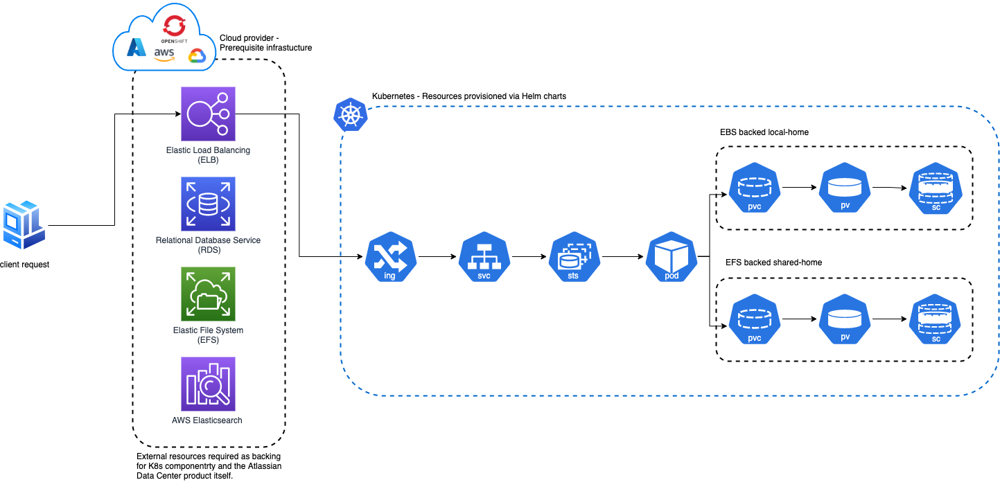

# Atlassian Data Center Helm Charts

 
 

This project contains [Helm charts](https://helm.sh/) for installing Atlassian's [Jira Data Center](https://www.atlassian.com/enterprise/data-center/jira), [Confluence Data Center](https://www.atlassian.com/enterprise/data-center/confluence), and [Bitbucket Data Center](https://www.atlassian.com/enterprise/data-center/bitbucket) on Kubernetes. 

Use the charts to install and operate Data Center products within a Kubernetes cluster of your choice. It can be a managed environment, such as [Amazon EKS](https://aws.amazon.com/eks/), [Azure Kubernetes Service](https://azure.microsoft.com/en-au/services/kubernetes-service/), [Google Kubernetes Engine](https://cloud.google.com/kubernetes-engine), or a custom on-premise system.

## Support disclaimer

These Helm charts are in **Beta phase and unsupported**, with the goal of introducing official support once they have been
stabilized.

Also, we **don’t officially support** the functionality described in the [examples](docs/examples) or the documented [platforms](docs/PLATFORMS.md). You should use them for reference only. 

## Architecture

The Atlassian Data Center Helm charts will provision and deploy the necessary Kubernetes resources required for running an Atlassian Data Center product within a Kubernetes cluster. The Helm charts rely a number of cloud based [prerequisites](./docs/PREREQUISITES.md) to be in place before installation. 

The diagram below provides a high-level overview of what a typical deployment might look like when using these Helm charts. A set of pre-provisioned resources have been stood up using a favoured cloud provider providing physical backing to those logical resources provisioned into the Kuberentes cluster itself.   

## Installing the Helm charts

* [Prerequisites and setup](docs/PREREQUISITES.md) - everything you need to do before installing the Helm charts
* [Installation](docs/INSTALLATION.md) - the steps to install the Helm charts

## Additional content

* [Operation](docs/OPERATION.md) - how to upgrade applications, scale your cluster, and update resources
* [Configuration](docs/CONFIGURATION.md) - a deep dive into the configuration parameters
* [Platforms support](docs/PLATFORMS.md) - how to allow support for different platforms
* [Examples](docs/examples/)
  * [How to deploy an EFK stack to Kubernetes](docs/examples/logging/efk/EFK.md)
  * [Implementation of an NFS Server for Bitbucket](docs/examples/storage/nfs/NFS.md)
  * [Local storage - utilizing AWS EBS-backed volumes](docs/examples/storage/aws/LOCAL_STORAGE.md)
  * [Shared storage - utilizing AWS EFS-backed filesystem](docs/examples/storage/aws/SHARED_STORAGE.md)
  * [SSH service in Bitbucket on Kubernetes](docs/examples/ssh/SSH_BITBUCKET.md)

## Feedback

If you find any issue, please [raise a ticket](https://github.com/atlassian-labs/data-center-helm-charts/issues/new). If you have general feedback or question regarding the charts, please use [Atlassian Community Kubernetes space](https://community.atlassian.com/t5/Atlassian-Data-Center-on/gh-p/DC_Kubernetes).
  

## Contributions

Contributions are welcome. [Find out how to contribute](CONTRIBUTING.md). 

## License

Copyright (c) [2021] Atlassian and others.
Apache 2.0 licensed, see [license file](LICENSE).
