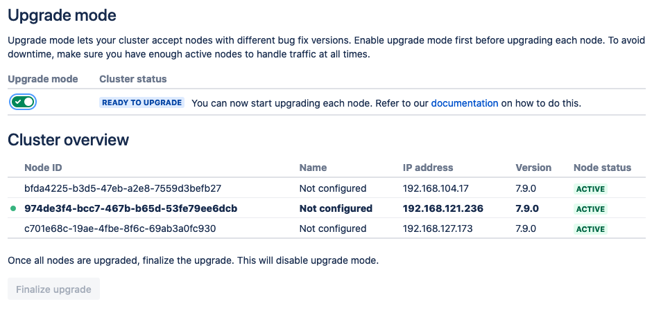
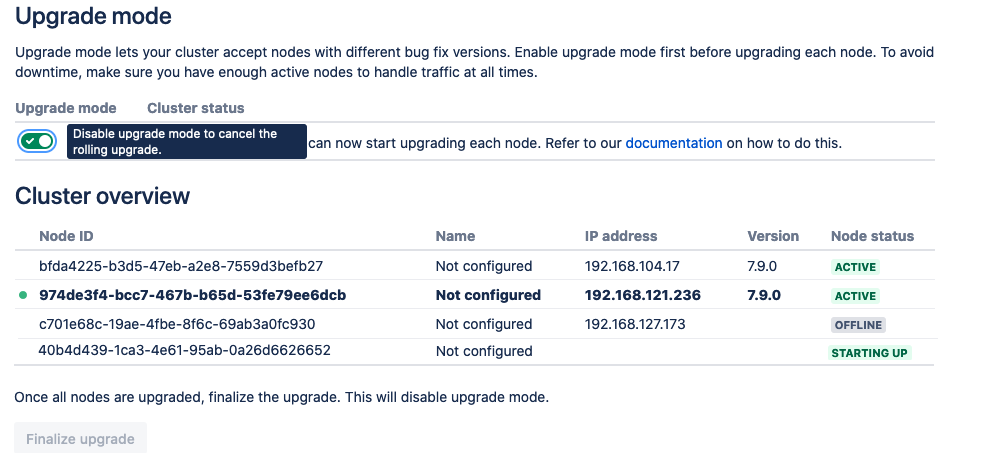
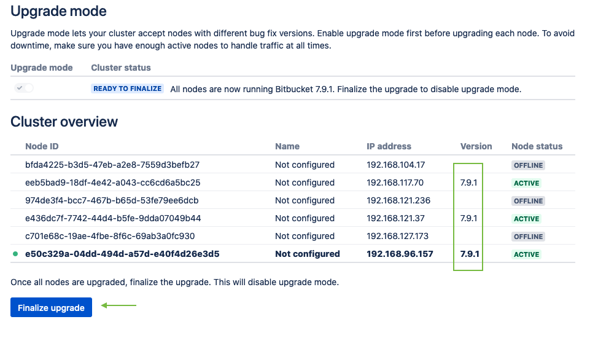

## Bitbucket Rolling Upgrade
Suppose we have a Bitbucket cluster with 3 nodes, all running `Bitbucket xx.xx.0-jdk11`, and an upgrade to
 `Bitbucket xx.xx.1-jdk11` is planned. Use these steps to complete the upgrade process: 

1. Update the `version` and `appVersion` in the Helm chart (`src/main/charts/bitbucket/Chart.yaml`):
   ```yaml
   version: 0.1.1
   appVersion: xx.xx.1-jdk11
   ```
1. Create a new version of the Helm package:
    ```shell script
    $ helm package src/main/charts/bitbucket --destination target/helm
    This will create target/helm/bitbucket-0.1.1.tgz 
    ```
1. From the admin page click on *Rolling Upgrade* and set the Bitbucket to Upgrade mode:
    

1. Run helm upgrade command with the desired number of nodes after upgrade (replicaCount):
    ```shell script
    $ helm upgrade -n dcd --wait <release name> --set replicaCount=3 target/helm/bitbucket-0.1.1.tgz --reuse-values
    ```

1. Upgrade will start by terminating one pod and creating a new pod with an updated version. 
    

1. After the new pod is up and running, the next pod will be upgraded until all pods are upgraded to the new version. 

1. After all pods are activated with the new version, finalize the upgrade.
    

To see the history of the Helm upgrade, run this command:

```shell script
$ helm history <release name>
REVISION UPDATED STATUS CHART APP VERSION DESCRIPTION
1 Tue May 4 11:56:33 2021 superseded bitbucket-0.1.0 xx.xx.0-jdk11 Install complete
2 Tue May 4 12:40:54 2021 deployed bitbucket-0.1.1 xx.xx.1-jdk11 Upgrade complete
```
