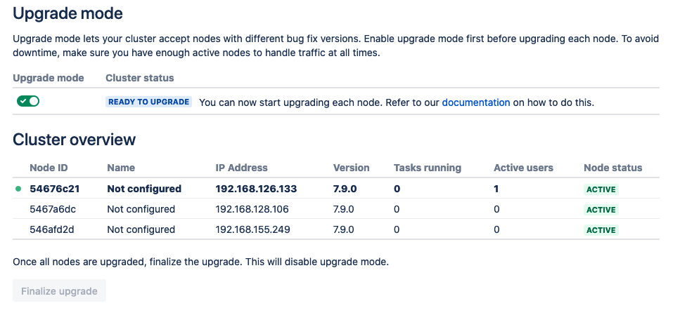
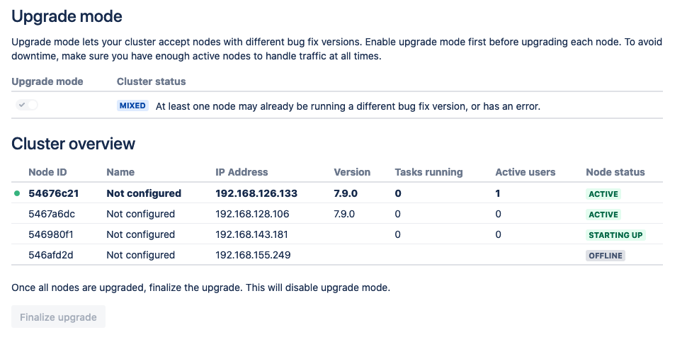
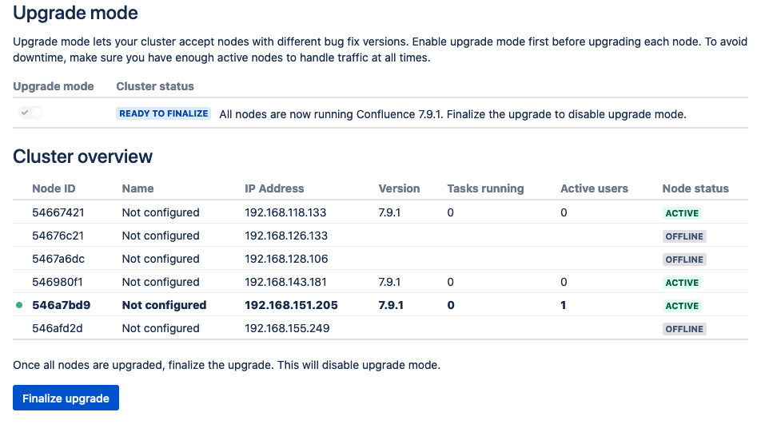

##Confluence Rolling Upgrade
Suppose we have a Confluence cluster with 3 nodes and all running `Confluence xx.xx.0-jdk11` and an upgrade to 
`Confluence xx.xx.1-jdk11` is planned. Here is the steps to complete the upgrade process: 

1. Update the `version` and `appVersion` in helm chart (`src/main/charts/bitbucket/Chart.yaml`):
 ```yaml
 version: 0.1.1
 appVersion: xx.xx.1-jdk11
 ```

1. Create a new version of helm package:
 ```shell script
 $ helm package src/main/charts/confluence --destination target/helm
 This will create target/helm/confluence-0.1.1.tgz 
 ```
1. From admin page click on *Rolling Upgrade* and set the Confluence in Upgrade mode:

 

1. Run helm upgrade command with the desired number of nodes after upgrade (replicaCount):
 ```shell script
 $ helm upgrade -n dcd --wait <release name> --set replicaCount=3 target/helm/confluence-0.1.1.tgz --reuse-values
 ```

1. Upgrade will start by terminating one pod and creating a new pod with an updated version. 

 

1. After the new pod is up and running, the next pod will be upgraded until all pods are upgraded to the new version. 

1. After all pods activated with the new version, finalize the upgrade:

    
