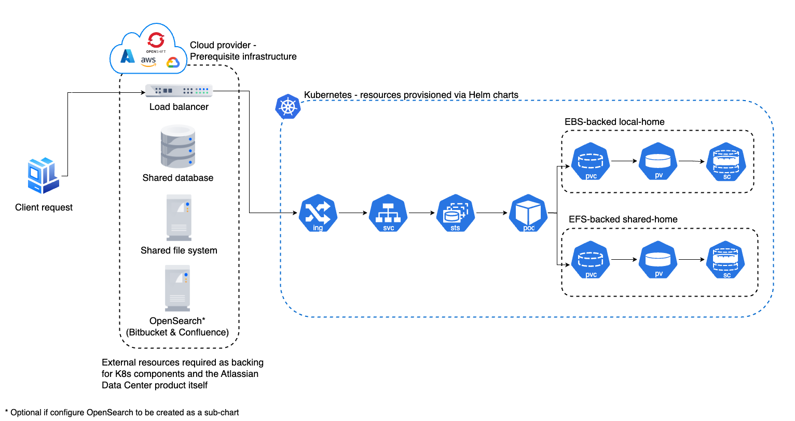

# Atlassian Data Center Helm Charts

 
 

This project contains [Helm charts](https://helm.sh/){.external} for installing Atlassian's [Jira Data Center](https://www.atlassian.com/enterprise/data-center/jira){.external}, [Confluence Data Center](https://www.atlassian.com/enterprise/data-center/confluence){.external}, [Bitbucket Data Center](https://www.atlassian.com/enterprise/data-center/bitbucket){.external} and [Bamboo Data Center](https://www.atlassian.com/software/bamboo){.external} on Kubernetes. 

Use the charts to install and operate Data Center products within a Kubernetes cluster of your choice. It can be a managed environment, such as [Amazon EKS](https://aws.amazon.com/eks/){.external}, [Azure Kubernetes Service](https://azure.microsoft.com/en-au/services/kubernetes-service/){.external}, [Google Kubernetes Engine](https://cloud.google.com/kubernetes-engine){.external}, or a custom on-premise system.

## Support disclaimer

!!! warning
    We **don’t officially support** the functionality described in the [examples](examples/EXAMPLES.md) or the documented [platforms](platforms/PLATFORMS.md). You should use them for reference only.
    
    Read more about [what we support and what we don’t](troubleshooting/SUPPORT_BOUNDARIES.md). 
    
    **Certain product limitations listed below:**

    * **Jira** currently has [limitations with scaling](troubleshooting/LIMITATIONS.md#jira-and-horizontal-scaling).
    * **Bamboo** has a number of limitations, [particularly with deployment and clustering](troubleshooting/LIMITATIONS/#deployment).
    * **Crowd** is not officially supported.
    
    Read more about these [product and platform limitations](troubleshooting/LIMITATIONS.md).

## Architecture

The diagram below provides a high level overview of what a typical deployment might look like when using the Atlassian Data Center Helm charts:

## Installing the Helm charts

* [Prerequisites and setup](userguide/PREREQUISITES.md) - everything you need to do before installing the Helm charts
* [Installation](userguide/INSTALLATION.md) - the steps to install the Helm charts
* [Migration](userguide/MIGRATION.md) - what you have to do if you're migrating an existing deployment to Kubernetes

## Additional content

* [Operation](userguide/OPERATION.md) - how to upgrade applications, scale your cluster, and update resources
* [Configuration](userguide/CONFIGURATION.md) - a deep dive into the configuration parameters
* [Platforms support](platforms/PLATFORMS.md) - how to allow support for different platforms
* [Examples](examples/EXAMPLES.md) - various configuration examples
* [Troubleshooting](troubleshooting/TROUBLESHOOTING.md) - how to debug issues with installation

## Product versions
The minimum versions that we support for each product are:

| Jira DC                                                                                                            | Confluence DC                                                                                         | Bitbucket DC                                                                                                                           | Bamboo DC                                                                                        |
|--------------------------------------------------------------------------------------------------------------------|------------------------------------------------------------------------------------------------------|----------------------------------------------------------------------------------------------------------------------------------------|--------------------------------------------------------------------------------------------------|
| [8.19](https://confluence.atlassian.com/jirasoftware/jira-software-8-19-x-release-notes-1082526044.html){.external} | [7.13](https://confluence.atlassian.com/doc/confluence-7-13-release-notes-1044114085.html){.external}  | [7.12](https://confluence.atlassian.com/bitbucketserver/bitbucket-data-center-and-server-7-12-release-notes-1044112744.html){.external} | [8.1](https://confluence.atlassian.com/bamboo/bamboo-8-1-release-notes-1103070461.html){.external}|
      

## Feedback

If you find any issues, [raise a ticket](https://support.atlassian.com/contact/){.external}. If you have general feedback or questions regarding the charts, use [Atlassian Community Kubernetes space](https://community.atlassian.com/t5/Atlassian-Data-Center-on/gh-p/DC_Kubernetes){.external}.
  

## Contributions

Contributions are welcome. [Find out how to contribute](https://github.com/atlassian/data-center-helm-charts/blob/main/CONTRIBUTING.md){.external}. 

## License

Apache 2.0 licensed, see [license file](https://github.com/atlassian/data-center-helm-charts/blob/main/LICENSE){.external}.
