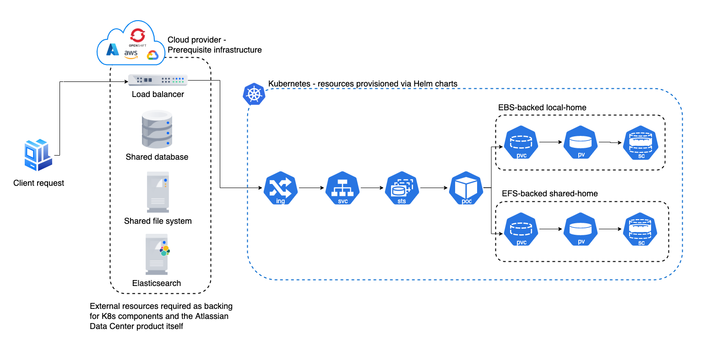

# Atlassian Data Center Helm Charts

 
 

This project contains [Helm charts](https://helm.sh/){.external} for installing Atlassian's [Jira Data Center](https://www.atlassian.com/enterprise/data-center/jira){.external}, [Confluence Data Center](https://www.atlassian.com/enterprise/data-center/confluence){.external}, and [Bitbucket Data Center](https://www.atlassian.com/enterprise/data-center/bitbucket){.external} on Kubernetes. 

Use the charts to install and operate Data Center products within a Kubernetes cluster of your choice. It can be a managed environment, such as [Amazon EKS](https://aws.amazon.com/eks/){.external}, [Azure Kubernetes Service](https://azure.microsoft.com/en-au/services/kubernetes-service/){.external}, [Google Kubernetes Engine](https://cloud.google.com/kubernetes-engine){.external}, or a custom on-premise system.

## Support disclaimer

!!! warning

    These Helm charts are in **Beta phase and unsupported**, with the goal of introducing official support once they have been
    stabilized.
    
    Also, we **don’t officially support** the functionality described in the [examples](examples/EXAMPLES.md) or the documented [platforms](platforms/PLATFORMS.md). You should use them for reference only. 

## Architecture

The diagram below provides a high level overview of what a typical deployment might look like when using the Atlassian Data Center Helm charts:

## Installing the Helm charts

* [Prerequisites and setup](installation/PREREQUISITES.md) - everything you need to do before installing the Helm charts
* [Installation](installation/INSTALLATION.md) - the steps to install the Helm charts

## Additional content

* [Operation](operations/OPERATION.md) - how to upgrade applications, scale your cluster, and update resources
* [Configuration](installation/CONFIGURATION.md) - a deep dive into the configuration parameters
* [Platforms support](platforms/PLATFORMS.md) - how to allow support for different platforms
* [Examples](examples/EXAMPLES.md) - various configuration examples

## Feedback

If you find any issue, please [raise a ticket](https://github.com/atlassian-labs/data-center-helm-charts/issues/new){.external}. If you have general feedback or question regarding the charts, please use [Atlassian Community Kubernetes space](https://community.atlassian.com/t5/Atlassian-Data-Center-on/gh-p/DC_Kubernetes){.external}.
  

## Contributions

Contributions are welcome. [Find out how to contribute](https://github.com/atlassian-labs/data-center-helm-charts/blob/master/CONTRIBUTING.md){.external}. 

## License

Apache 2.0 licensed, see [license file](https://github.com/atlassian-labs/data-center-helm-charts/blob/master/LICENSE){.external}.
