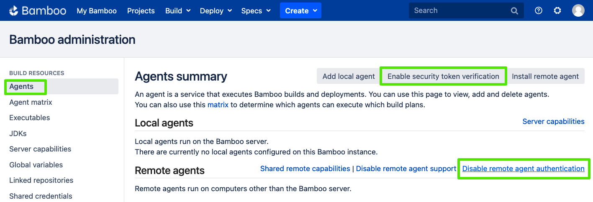
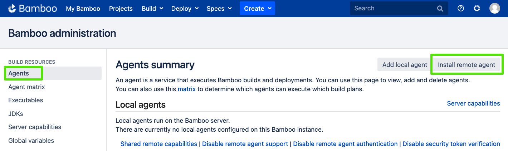
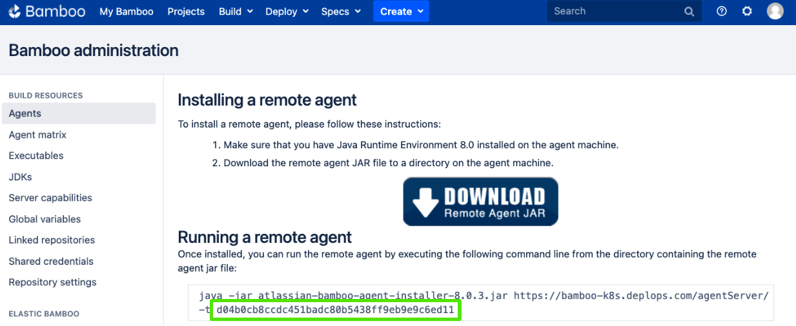

# Remote agents

Remote agents can be provisioned to a Kubernetes cluster to run jobs delegated to them via a Bamboo server. An agent can run a job if its capabilities match the requirements of a job. Each job inherits the requirements from individual tasks that it contains.

You can learn more details about remote agents on the [official documentation page](https://confluence.atlassian.com/bamboo/agents-and-capabilities-289277114.html).

## Requirements

!!!warning "Bamboo server prerequisites"

    * The Bamboo server instance must use a valid Bamboo Data Center instance license and be fully configured
    * The Bamboo server instance must have `security token verification` **enabled**
    * The Bamboo server instance must have `remote agent authentication` **disabled**

## Deployment

Steps required for deploying a remote agent

1. Configure Bamboo server for remote agent support
2. Deploy agent

### 1. Configure Bamboo server

There are 2 approaches for doing this:

* Automatically when deploying Bamboo server
* Manually via Bamboo server agent settings

#### Automatically

When initially deploying Bamboo server its `values.yaml` can be configured to:

* disable `remote agent authentication`
* define a custom `security token` 

This will allow remote agents that are configured with the same security token to automatically join the cluster. 

First, create a secret to store a custom security token with which remote agent(s) should authenticate to the Bamboo server. 

!!!info "Security token format"
    
    The security token should be set to a 40-character hexadecimal string. The following command can be used to generate a string in this format:
    ```
    xxd -l 20 -p /dev/urandom
    ```

Add the generated string (security token) to a K8s secret

   ``` shell
   kubectl create secret generic security-token --from-literal=security-token=<security token>
   ```

Update the Bamboo `values.yaml` with this secret and disable agent authentication:

```yaml
bamboo:
  securityToken:
    secretName: "security-token"
    secretKey: security-token
  disableAgentAuth: true
```

!!!warning "Disabling remote agent authentication"

    when setting the property `disableAgentAuth` to `true` this will have the effect of automatically allowing agents with the correct security token to communicate with the Bamboo server. This property is useful for testing, and when deployments requiring many agents are needed. This property can also be left in its default state of `false` in which case each agent will need to be approved manually via the `Agents` settings tab of the Bamboo server instance. Additional details on agent authentication can be found [here](https://confluence.atlassian.com/bamboo/agent-authentication-289277196.html)  
    

#### Manually

* When logged into the Bamboo server instance, and from the `Agents` settings tab, **enable** `security token verification`, and **disable** `remote agent authentication`
   { width="900" }
   
* Navigate to the remote agent's installation page by selecting the `Install remote agent` button from the `Agents` settings tab
   { width="900" }

* Create a K8s secret using the `security token` rendered on the `Installing a remote agent` page
   { width="900" }
      
   create secret using token...
   
   ``` shell
   kubectl create secret generic security-token --from-literal=security-token=<security token>
   ```

### 2. Deploy agent 

* Update the bamboo agent `values.yaml` to utilize the security token secret and point to the bamboo server instance

```yaml
replicaCount: 3
agent:
  securityToken:
    secretName: "security-token"
    secretKey: security-token
  server: "bamboo.bamboo.svc.cluster.local"
```

!!!info "Values"

      * As long as your cluster has the physical resources the `replicaCount` can be set to any value from `1` .. `1 + n` 
      * `agent.server` should be configured with the K8s DNS record for the Bamboo server service. The value should be of the form: `<service_name>.<namespace>.svc.cluster.local`

* Install the agent

```shell
helm install bamboo-agent atlassian-data-center/bamboo-agent -f values.yaml
```

!!!tip "Custom agents"

        By default the Bamboo agent Helm chart will deploy the [bamboo-agent-base](https://hub.docker.com/r/atlassian/bamboo-agent-base){.external} Docker image. This image provides the following capabilities out of the box:
        
        * JDK 11
        * Git & Git LFS
        * Maven 3
        * Python 3

        For details on defining and deploying agents with custom/additional capabilities view the [agent capabilities guide](AGENT_CAPABILITIES.md)

## Scaling the agent count

The number of active agents can be easily increased or decreased: 

``` shell
helm upgrade --set replicaCount=<desired number of agents> \
             --reuse-values \
             <name of the release>
             atlassian-data-center/bamboo-agent
```

## Troubleshooting

You can find the most common errors relating to agent configuration in the [official Bamboo agent documentation](https://confluence.atlassian.com/bamboo/bamboo-remote-agent-installation-guide-289276832.html){.external}.
