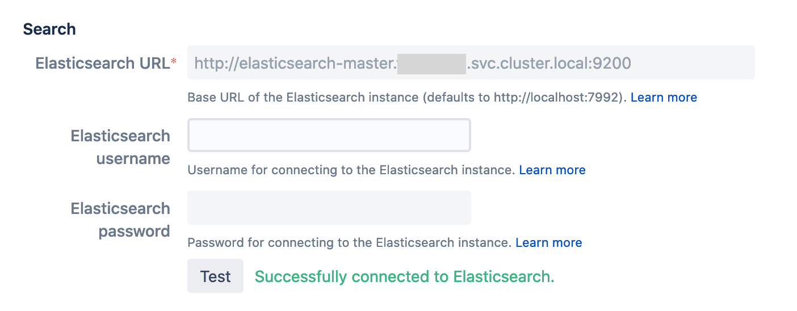

# Bitbucket Elasticsearch recommendations
While Bitbucket has its own internal Elasticsearch instance, we highly recommend you use an external Elasticsearch installation, either within the Kubernetes cluster or, if available, an instance managed by your hosting provider.

## Installing and configuring Elasticsearch in your Kubernetes cluster
### Installing Elasticsearch into your Kubernetes cluster
Choose a version of Elasticsearch that is supported by the [version of Bitbucket you are installing](https://confluence.atlassian.com/bitbucketserver/supported-platforms-776640981.html#Supportedplatforms-additional-toolsAdditionaltools){.external}. For Bitbucket 7.14 the latest supported Elasticsearch version is 7.9.3, so we will target that.

There are official [Helm charts for Elasticsearch 7.9.3](https://artifacthub.io/packages/helm/elastic/elasticsearch/7.9.3){.external}. Following the documentation there add the Elasticsearch Helm charts repository:

```bash
helm repo add elastic https://helm.elastic.co
```
then install it:
```bash
helm install elasticsearch --namespace <namespace> --set imageTag="7.9.3" elastic/elasticsearch
```
!!! info "Prerequisites of Elasticsearch Helm chart"
    Running the above commands will install Elasticsearch with the default configuration, which is 3 worker nodes. 
    However, it may not always work out of the box if failed to fulfill prerequisites for the default installation. 
    Some example prerequisites include:

    * CPU/memory requests: 1000m/2Gi (for each worker node)
    * Preconfigured storage volumes (30Gi for each worker node)
    
    For more details refer to [Elasticsearch values.yaml file](https://github.com/elastic/helm-charts/blob/7.9/elasticsearch/values.yaml){.external}.

### Configuring your Bitbucket deployment

To enable the installed Elasticsearch service you need to configure the service URL under `bitbucket:` stanza in the `values.yaml` file.
Check the Kubernetes official documentation on how to get [DNS record for a service](https://kubernetes.io/docs/concepts/services-networking/dns-pod-service/#services){.external}.
```yaml
bitbucket:
  elasticSearch:
    baseUrl: http://elasticsearch-master.<namespace>.svc.cluster.local:9200
```
This will also have the effect of disabling Bitbucket’s internal Elasticsearch instance.

!!! info "Elasticsearch security"
    If you have Elasticsearch cluster with [security enabled](https://github.com/elastic/helm-charts/tree/master/elasticsearch#how-to-deploy-clusters-with-security-authentication-and-tls-enabled){.external}, i.e. having credential details stored in a Kubernetes secret and passed into `extraEnvs` as this [example](https://github.com/elastic/helm-charts/blob/master/elasticsearch/examples/security/values.yaml#L23){.external} does, you can then use the same secret and configure that in the bitbucket `values.yaml` file:       
    ```yaml
    bitbucket:
      elasticSearch:    
         credentials:
            secretName: <my-elasticsearch-secret>
            usernameSecretKey: username
            passwordSecretKey: password
    ```
    Read about [Kubernetes secrets](https://kubernetes.io/docs/concepts/configuration/secret/){.external}.


## Configuring Amazon Elasticsearch Service with Bitbucket on Kubernetes

### Creating an Amazon Elasticsearch Service domain with a master user

The Elasticsearch instance (“domain”) can be created via the AWS CLI or the web console; for this example we will use the web console and a master user:

1. In the EKS console navigate to **Your Cluster → Networking** and note the VPC ID.
2. In the Elasticsearch console create a new domain:
   1. Select a production deployment.
   2. Select Elasticsearch version 7.9.
3. In the next screen configure the AZs and nodes as appropriate for your expected workload.
4. On the **Access and security** page:
   1. Select the same VPC as the EKS cluster, as noted in step 1.
   2. Select appropriate subnets for each AZ; private subnets are fine.
   3. Select appropriate security groups that will grant node/pod access.
   4. Tick **Fine–grained access control**:
     * Select **Create master user** and add a username and a strong password.
5. Configure tags, etc. as appropriate for your organisation.

Once the Elasticsearch domain has finished creating, make a note of the **VPC Endpoint**, which will be an HTTPS URL.

### Configuring your Bitbucket deployment

To use the managed Elasticsearch service, first create a Kubernetes secret using the username and password from step 4 above. Then configure the service URL under `bitbucket:` in the `values.yaml` file, substituting the values below from the above steps where appropriate:
```yaml
bitbucket:
  elasticSearch:
    baseUrl: <VPC Endpoint>
    credentials:
      secretName: <my-elasticsearch-secret>
      usernameSecretKey: username
      passwordSecretKey: password
```
!!! info ""
    Read about [Kubernetes secrets](https://kubernetes.io/docs/concepts/configuration/secret/){.external}.

## Testing your Elasticsearch connection
To test if Elasticsearch is properly set up, go to **Administration > System - Server settings**. The Elasticsearch URL should be pre-populated already in the search section. Click the **Test** button to see if it connects successfully.

