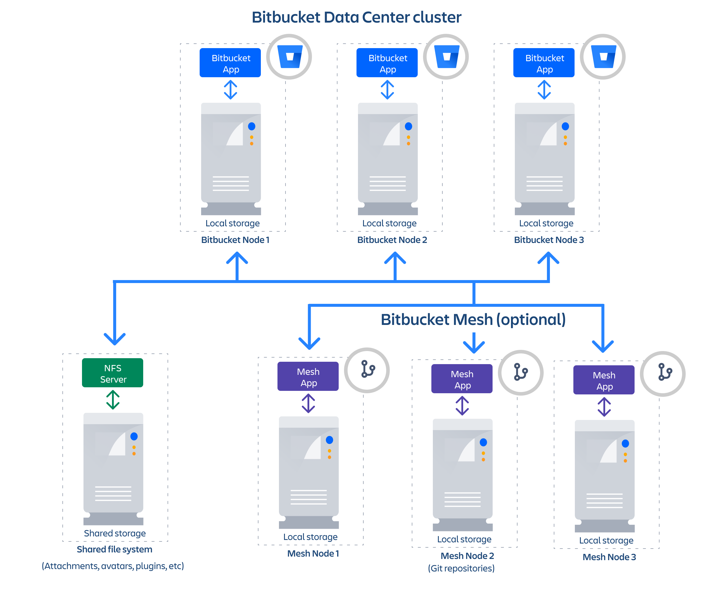

# Bitbucket Mesh

Bitbucket Mesh is a distributed, replicated, and horizontally scalable Git repository storage system, which increases performance and improves the resilience of Bitbucket.



You can learn more details about Bitbucket Mesh on the [official documentation page](https://confluence.atlassian.com/bitbucketserver/bitbucket-mesh-1128304351.html){.external}.

!!!tip "Recommendations for Mesh deployments"

    **Bitbucket version**

    By default, the Helm charts target the latest Bitbucket LTS version. However,
    Mesh is only supported from version 8.0. You will need to select an 8.x
    version of Bitbucket to deploy Mesh. Learn more details below.

    **Mesh agent version**

    Bitbucket Mesh agents are versioned independently from Bitbucket. You should
    select the appropriate version for the deployed version of Bitbucket. See
    the [Mesh download page](https://www.atlassian.com/software/bitbucket/download-mesh-archives){.external}
    for available versions.

    **Number of Mesh nodes**

    In order for high-availability to be possible, we recommend having a minimum
    of three Mesh nodes. There is no maximum on the number of nodes.

    **Mesh node co-location**

    We don't currently support deploying Mesh nodes into multiple
    availability zones. Just like the shared file system based deployments, the
    Mesh nodes (that is, the repository storage) and the application nodes must
    be co-located.

    **Other Mesh deployment requirements**

    For more details on the requirements and limitations of Mesh deployments, check the
    [the Bitbucket Mesh FAQ](https://confluence.atlassian.com/enterprise/bitbucket-data-center-faq-776663707.html#BitbucketDataCenterFAQ-Mesh){.external}.


### Configuring your Bitbucket and Mesh deployment

For backwards compatibility, the Helm charts default to Mesh being disabled. To
enable it, you will need to configure the service under `bitbucket:` stanza in
the `values.yaml` file, substituting the values below from the above steps where
appropriate:

```yaml
image:
  tag: <an 8.x.x version of Bitbucket>

bitbucket:
  mesh:
    enabled: true
    image:
      version: <Mesh agent version>
```

### Adding the Mesh nodes to Bitbucket

To enable the deployed Mesh nodes you need to add them to the Bitbucket Data
Center instance in the administration area. To do so, you'll need the
service URL of each node; these are usually of the form `bitbucket-mesh-<num>`. Check the Kubernetes
official documentation to learn how to get a [DNS record for a service](https://kubernetes.io/docs/concepts/services-networking/dns-pod-service/#services){.external}.

To connect the Mesh node:

1. In your Bitbucket Data Center instance, navigate to **Administration** > **Git** > **Bitbucket Mesh**.
1. Enter the URL of the Mesh node in the Node URL field (e.g. `http://bitbucket-mesh-1:7777`).
1. (Optional) Enter a name for the Mesh node in the Node name field.
1. Select **Add Mesh node**.

[Learn more details about Mesh configuration](https://confluence.atlassian.com/bitbucketserver/set-up-and-configure-mesh-nodes-1128304356.html#SetupandconfigureMeshnodes-ConnectingtheMeshnodetoBitbucket).

### Migrating existing repositories to Mesh

[Learn how to migrate repositories to Mesh](https://confluence.atlassian.com/bitbucketserver/migrate-repositories-to-bitbucket-mesh-1128304358.html).
