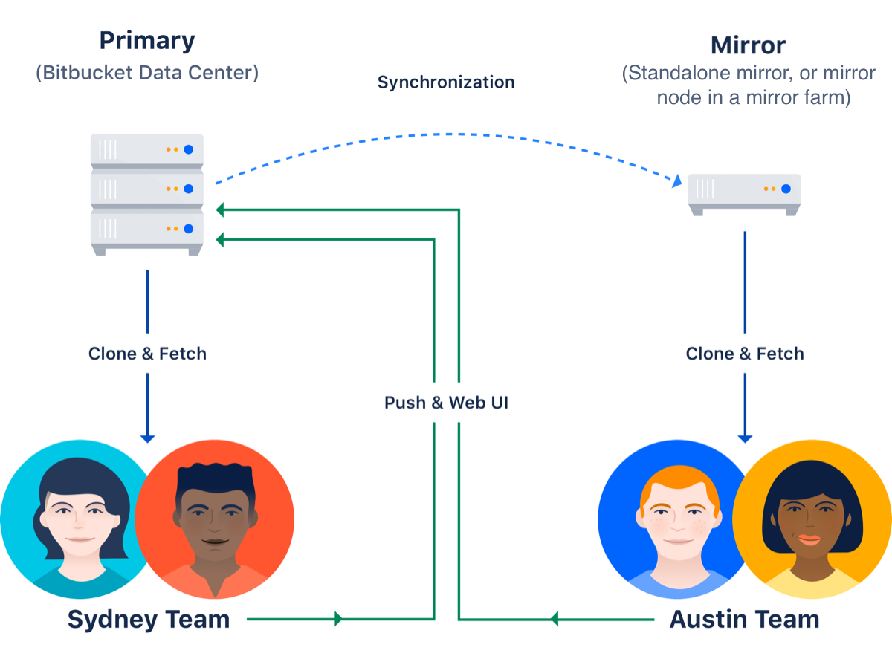
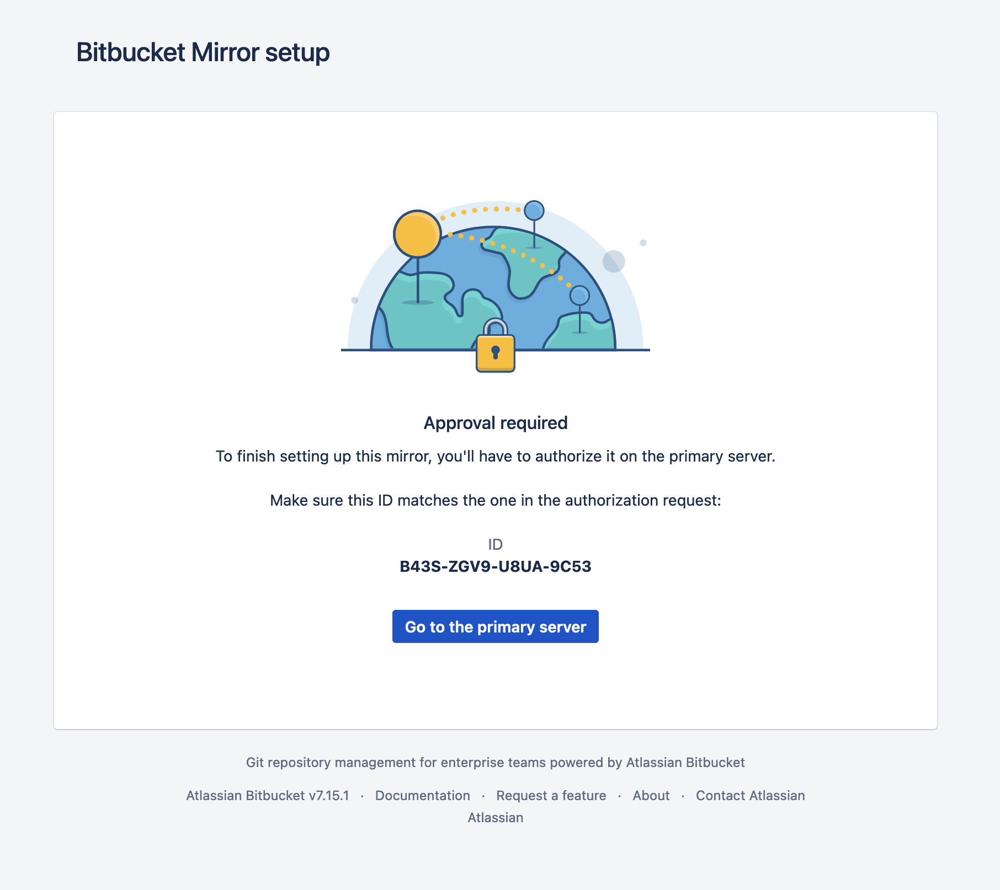
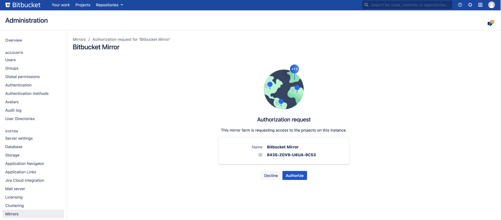
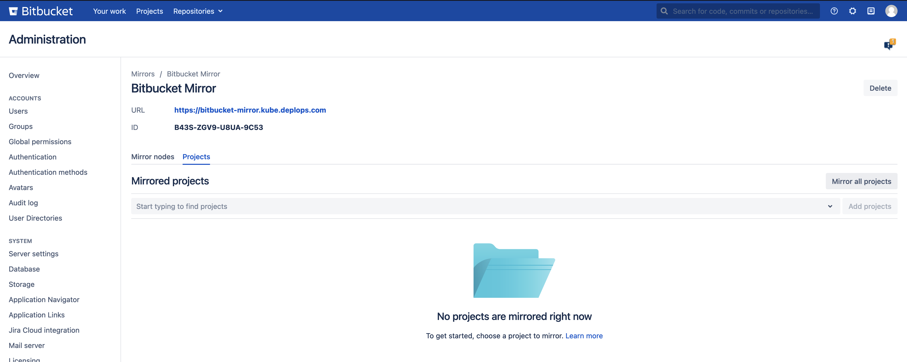
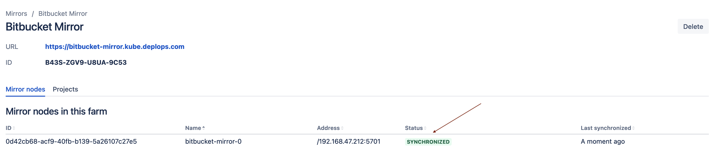
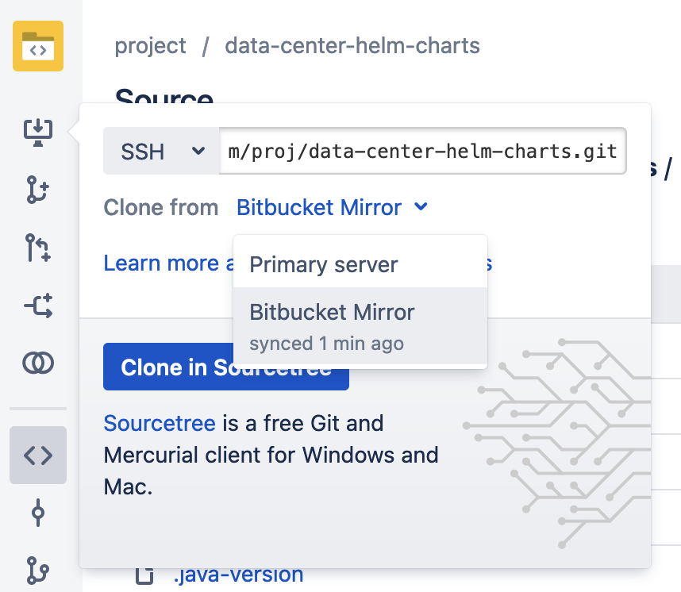

# Smart Mirroring

Smart Mirroring can greatly improve Git clone speeds for distributed teams working with large repositories. Large repositories that take hours to clone from a Bitbucket instance over the Internet from the other side of the world can take minutes when cloned from a local mirror on a fast network.



You can learn more details about smart mirroring on the [official documentation page](https://confluence.atlassian.com/bitbucketserver/smart-mirroring-776640046.html).

!!!tip "Upstream/Primary instance"
    **Primary instance** is sometimes called **upstream** instance.


## Requirements

!!!warning "Primary instance prerequisites"
    
    **Your primary Bitbucket instance must be a fully licensed Bitbucket Data Center instance**
    
    You do not have to run your Bitbucket Data Center instance as a multi-node cluster to use smart mirroring, but you must have an up-to-date Data Center license.

    **The primary instance and all mirror(s) must have HTTPS with a valid (i.e., signed by a Certificate Authority anchored to the root and not expired) SSL certificate**
    
    This is a strict requirement of smart mirroring on both the primary instance and all mirror(s), and cannot be bypassed. The mirror setup wizard will not proceed if either the mirror or the primary instance does not have a valid SSL certificate.

    **The primary Bitbucket instance must have SSH enabled**
    
    Mirrors keep their repositories synchronized with the primary instance over SSH and cannot use HTTP or HTTPS for this. See Enable SSH access to Git repositories for instructions on enabling SSH access on your primary instance.


## Installation

### Overview

1. Install the **primary** as usual with Bitbucket Helm chart.
      * You need to make sure the instance complies with all the above listed requirements.
2. Install the **mirror** with second Bitbucket Helm chart.
      * There is a set of properties that need to be configured to make the mirror work.
3. Approve the **mirror** in the **primary** instance.

### Steps

#### Mirror Farm installation in Kubernetes

!!!info Ingress configuration
  
    Example is using [nginx-ingress controller](../ingress/INGRESS_NGINX.md). If you are using a different ingress controller, you will need to modify the example.

1. Install the **primary** as usual with Bitbucket Helm chart.
      * You need to make sure the instance complies with all the above listed requirements.
      * Verify that you are able to clone from the primary via SSH protocol.
      * Verify that primary instance is accessible over HTTPS with a valid SSL certificate.
2. Create a new file `values-mirror.yaml` with the following content:
``` yaml
bitbucket:
  mode: mirror
  displayName: Bitbucket Mirror
  clustering:
    enabled: true
  applicationMode: "mirror"
  mirror:
    upstreamUrl: <https url of the primary> # for example https://bitbucket-upstream.example.com

# nginx specific configuration
ingress:
  create: true
  host: bitbucket-mirror.example.com
  annotations:
    cert-manager.io/issuer: "letsencrypt-prod" # Default issuer
  tlsSecretName: <secret with TLS private key> # E.g. tls-certificate-mirror

# enables persistence for mirror data
volumes:
  localHome:
    persistentVolumeClaim:
      create: true
```
3. Edit the file to change the placeholder values.
      * `bitbucket.mirror.upstreamUrl`
      * `ingress.host`
      * `ingress.tlsSecretName`
4. Install the mirror
    ``` shell
      helm install bitbucket-mirror atlassian-data-center/bitbucket -f values-mirror.yaml
    ```

#### Mirror farm authorization

These steps are described in detail in [official documentation](https://confluence.atlassian.com/bitbucketserver/set-up-and-configure-a-mirror-farm-978205589.html#Setupandconfigureamirrorfarm-4.Approvethemirrorfarmrequest).

1. Visit the mirror URL (it might take a couple of minutes to come up)
2. Click on *Go to the primary server* in the mirror UI. The link will take you to the administration section of the primary instance.<br />
   { width="400" }
3. Click *Authorize* next to the mirror<br />
    
4. Select which projects should be synchronized<br />
    
5. Wait for the projects to be synchronized<br />
    
6. Verify that the synchronized projects can be cloned from the mirror<br />
    { width="400"}

## Scaling the mirror farm

As the mirror is deployed with all the fulfilled requirements for the Bitbucket Mirror Farm, you are able to scale the mirrors easily. To increase or decrease the size of the mirror farm:

``` shell
helm upgrade --set replicaCount=<desired number of mirror nodes> \
             --reuse-values \
             <name of the release>
             atlassian-data-center/bitbucket
```

## Adding or removing additional mirror farms

It is possible to connect multiple mirror farms to a single primary instance. This can be useful to improve local performance for geographically distributed teams.

*To add a new mirror farm*, follow the same steps that were necessary to connect the first mirror farm. This means installing another helm release and authenticating it in the administrator user interface.

*To remove a mirror farm*:

1. Navigate to *Mirrors* administration section on the **primary**
2. Select the mirror from the list
3. Click *Delete* button
4. Uninstall the deleted mirror helm release from the cluster

## Troubleshooting

You can find the most common errors in mirror configuration described in the [official Bitbucket documentation](https://confluence.atlassian.com/bitbucketserverkb/troubleshooting-smart-mirroring-838407670.html).