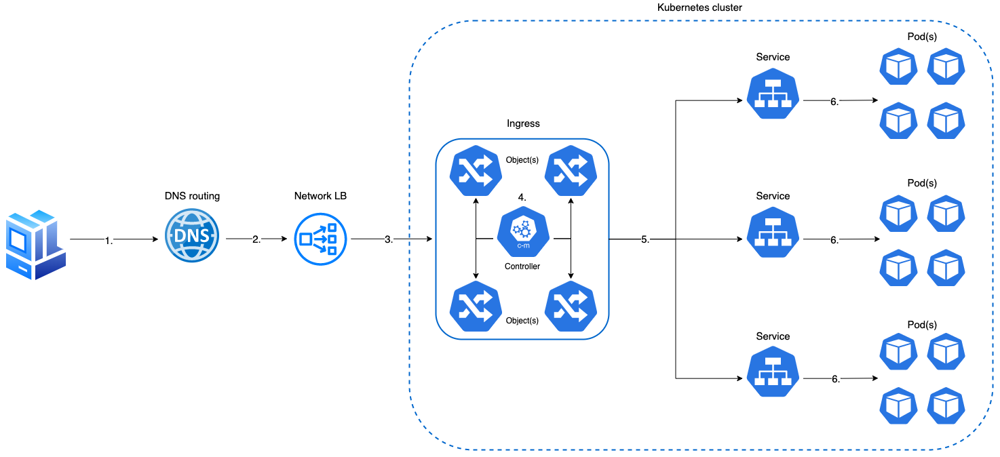

# Configuration

## :material-directions-fork: Ingress
In order to make the Atlassian product available from outside of the Kubernetes cluster, a suitable HTTP/HTTPS ingress controller needs to be installed. The standard Kubernetes Ingress resource is not flexible enough for our needs, so a third-party ingress controller and resource definition must be provided. The exact details of the Ingress will be highly site-specific. These Helm charts were tested using the [NGINX Ingress Controller](https://kubernetes.github.io/ingress-nginx/){.external}. We also provide [example instructions](../examples/ingress/CONTROLLERS.md) on how this controller can be installed and configured.

The charts themselves provide a template for Ingress resource rules to be utilised by the provisioned controller. These include all required annotations and optional TLS configuration for the NGINX Ingress Controller.

Some key considerations to note when configuring the controller are:

!!!Ingress requirements
    * At a minimum, the ingress needs the ability to support long request timeouts, as well as session affinity (aka "sticky sessions").
    * The Ingress Resource provided as part of the Helm charts is geared toward the [NGINX Ingress Controller](https://kubernetes.github.io/ingress-nginx/){.external} and can be configured via the `ingress` stanza in the appropriate `values.yaml`. Some key aspects that can be configured include:

         * Usage of the NGINX Ingress Controller
         * Ingress Controller annotations
         * The request max body size
         * The hostname of the ingress resource

    * When installed, with the provided [configuration](https://kubernetes.github.io/ingress-nginx/deploy/){.external}, the NGINX Ingress Controller will provision an internet-facing (see diagram below) load balancer on your behalf. The load balancer should either support the [Proxy Protocol](https://www.haproxy.org/download/1.8/doc/proxy-protocol.txt){.external} or allow for the forwarding of `X-Forwarded-*` headers. This ensures any backend redirects are done so over the correct protocol.
    * If the `X-Forwarded-*` headers are being used, then enable the [use-forwarded-headers](https://kubernetes.github.io/ingress-nginx/user-guide/nginx-configuration/configmap/#use-forwarded-headers){.external} option on the controllers `ConfigMap`. This ensures that these headers are appropriately passed on.
    * The diagram below provides a high-level overview of how external requests are routed via an internet-facing load balancer to the correct service via Ingress.



!!!note "Traffic flow (diagram)"
    0. Inbound client request
    1. DNS routes request to appropriate LB
    2. LB forwards request to internal Ingress
    3. Ingress controller performs traffic routing lookup via Ingress object(s)
    4. Ingress forwards request to appropriate service based on Ingress object routing rule
    5. Service forwards request to appropriate pod
    6. Pod handles request

!!!info "Request body size"
    By default the maximum allowed size for the request body is set to `250MB`. If the size in a request exceeds the maximum size of the client request body, an `413` error will be returned to the client. The maximum request body can be configured by changing the value of `maxBodySize` in `values.yaml`.


## :material-directions-fork: LoadBalancer/NodePort Service Type

!!!info "Feature Availability"
    Service session affinity configuration is available starting from Helm chart version 1.13

It is possible to make the Atlassian product available from outside of the Kubernetes cluster without using an ingress controller.

### NodePort Service Type

When installing Helm release, you can set:

```yaml
jira:
  service:
      type: NodePort
      sessionAffinity: ClientIP
      sessionAffinityConfig:
        clientIP:
          timeoutSeconds: 10800
```

The service port will be exposed on a random port from the ephemeral port range (`30000`-`32767`) on all worker nodes. You can provision a LoadBalancer with `443` or `80` (or both) listeners that will forward traffic to the node port (you can get service node port by running `kubectl describe $service -n $namespace`). Both LoadBalancer and Kubernetes service should be configured to maintain session affinity. LoadBalancer session affinity should be configured as per instructions for your Kubernetes/cloud provider. Service session affinity is configured by overriding the default Helm chart values (see the above example). Make sure you configure networking rules to allow the LoadBalancer to communicate with the Kubernetes cluster worker node on the node port.

!!!tip
    For more information about Kubernetes service session affinity, see [Kubernetes documentation](https://kubernetes.io/docs/reference/networking/virtual-ips/#session-affinity){.external}.

### LoadBalancer Service Type
    
LoadBalancer service type is the automated way to expose the service on the node port, create a LoadBalancer for it and configure networking rules allowing communication between the LoadBalancer and the Kubernetes cluster worker nodes:

```yaml
jira:
  service:
      type: LoadBalancer
      sessionAffinity: ClientIP
      sessionAffinityConfig:
        clientIP:
          timeoutSeconds: 10800
```

!!!warning "AWS EKS users"
    If you install the Helm chart for the first time, you will need to skip overriding `sessionAffinity` in your `values.yaml`, otherwise the LoadBalancer will not be created and you will see the following error:
    ```
    Error syncing load balancer: failed to ensure load balancer: unsupported load balancer affinity: ClientIP
    ```
    Once the Helm chart is installed with the default `sessionAffinity`, run `helm upgrade` with `$productName.service.sessionAffinity` set to `ClientIP`.

## :material-folder-home: Volumes
The Data Center products make use of filesystem storage. Each DC node has its own `local-home` volume, and all nodes in the DC cluster share a single `shared-home` volume.

By default, the Helm charts will configure all of these volumes as ephemeral [emptyDir](https://kubernetes.io/docs/concepts/storage/volumes/#emptydir){.external} volumes. This makes it possible to install the charts without configuring any volume management, but comes with two big caveats:

1. Any data stored in the `local-home` or `shared-home` will be lost every time a pod starts.
1. Whilst the data that is stored in `local-home` can generally be regenerated (e.g. from the database), this can be a very expensive process that sometimes requires manual intervention.

For these reasons, the default volume configuration of the Helm charts is suitable only for running a single DC pod for evaluation purposes. Proper volume management needs to be configured in order for the data to survive restarts, and for multi-pod DC clusters to operate correctly.

While you are free to configure your Kubernetes volume management in any way you wish, within the constraints imposed by the products, the recommended setup is to use Kubernetes [PersistentVolumes](https://kubernetes.io/docs/concepts/storage/persistent-volumes/){.external} and `PersistentVolumeClaims`.

The `local-home` volume requires a `PersistentVolume` with [ReadWriteOnce (RWO)](https://kubernetes.io/docs/concepts/storage/persistent-volumes/#access-modes){.external} capability, and `shared-home` requires a `PersistentVolume` with [ReadWriteMany (RWX)](https://kubernetes.io/docs/concepts/storage/persistent-volumes/#access-modes){.external} capability. Typically, this will be an NFS volume provided as part of your infrastructure, but some public-cloud Kubernetes engines provide their own `RWX` volumes (e.g. [AWS EFS](https://aws.amazon.com/efs/){.external} and [Azure Files](https://docs.microsoft.com/en-us/azure/storage/files/storage-files-introduction){.external}). While this entails a higher upfront setup effort, it gives the best flexibility.

### Volumes configuration
By default, the charts will configure the `local-home` and `shared-home` values as follows:

```yaml
volumes:
  - name: local-home
    emptyDir: {}
  - name: shared-home
    emptyDir: {}
```

As explained above, this default configuration is suitable only for evaluation or testing purposes. Proper volume management needs to be configured.

!!!info "Bitbucket default `shared-home` location"
    For a single node Bitbucket deployment, if no `shared-home` volume is defined, then a subpath of `local-home` will automatically be used for this purpose, namely: `<LOCAL_HOME_DIRECTORY>/shared`. This behaviour is specific to Bitbucket itself and is not orchestrated via the Helm chart.

In order to enable the persistence of data stored in these volumes, it is necessary
to replace these volumes with something else.

The recommended way is to enable the use of `PersistentVolume` and `PersistentVolumeClaim`
for both volumes, using your install-specific `values.yaml` file, for example:

```yaml
volumes:
  localHome:
    persistentVolumeClaim:
      create: true
  sharedHome:
    persistentVolumeClaim:
      create: true
```

This will result in each pod in the `StatefulSet` creating a `local-home` `PersistentVolumeClaim`
of type `ReadWriteOnce`, and a single `PersistentVolumeClaim` of type `ReadWriteMany` being created for the `shared-home`.

For each `PersistentVolumeClaim` created by the chart, a suitable `PersistentVolume` needs to be made available prior
to installation. These can be provisioned either statically or dynamically, using an
auto-provisioner.

An alternative to `PersistentVolumeClaims` is to use inline volume definitions,
either for `local-home` or `shared-home` (or both), for example:

```yaml
volumes:
  localHome:
    customVolume:
      hostPath:
        path: /path/to/my/data
  sharedHome:
    customVolume:
      nfs:
        server: mynfsserver
        path: /export/path
```

Generally, any valid Kubernetes volume resource definition can be substituted
here. However, as mentioned previously, externalising the volume definitions
using `PersistentVolumes` is the strongly recommended approach.

### Volumes examples

1. Bitbucket needs a dedicated NFS server providing persistence for a shared home. Prior to installing the Helm chart, a suitable NFS shared storage solution must be provisioned. The exact details of this resource will be highly site-specific, but you can use this example as a guide: [Implementation of an NFS Server for Bitbucket](../examples/storage/nfs/NFS.md).
2. We have an example detailing how an existing EFS filesystem can be created and consumed using static provisioning: [Shared storage - utilizing AWS EFS-backed filesystem](../examples/storage/aws/SHARED_STORAGE.md).
3. You can also refer to an example on how a Kubernetes cluster and helm deployment can be configured to utilize AWS EBS backed volumes: [Local storage - utilizing AWS EBS-backed volumes](../examples/storage/aws/LOCAL_STORAGE.md).

### Additional volumes

In addition to the `local-home` and `shared-home` volumes that are always
attached to the product pods, you can attach your own volumes for your own
purposes, and mount them into the product container.  Use the `additional`
(under `volumes`) and `additionalVolumeMounts` values to both attach the volumes
and mount them in to the product container.

This might be useful if, for example, you have a custom plugin that requires its
own filesystem storage.

Example:

```yaml
jira:
  additionalVolumeMounts:
    - volumeName: my-volume
      mountPath: /path/to/mount
volumes:
  additional:
    - name: my-volume
      persistentVolumeClaim:
        claimName: my-volume-claim
```

## :material-database: Database connectivity

The products need to be supplied with the information they need to connect to the
database service. Configuration for each product is mostly the same, with some small differences.

### `database.url`

All products require the JDBC URL of the database. The format if this URL depends
on the JDBC driver being used, but some examples are:

| Vendor        | JDBC driver class                               | Example JDBC URL                                        |   
|---            |---                                              |---                                                      |
| PostgreSQL    | `org.postgresql.Driver`                         | `jdbc:postgresql://<dbhost>:5432/<dbname>`              |   
| MySQL         | `com.mysql.jdbc.Driver`                         | `jdbc:mysql://<dbhost>/<dbname>`                        |   
| SQL Server    | `com.microsoft.sqlserver.jdbc.SQLServerDriver`  | `jdbc:sqlserver://<dbhost>:1433;databaseName=<dbname>`  |   
| Oracle        | `oracle.jdbc.OracleDriver`                      | `jdbc:oracle:thin:@<dbhost>:1521:<SID>`                 |

!!!info "Database creation"

    The Atlassian product doesn't automatically create the database,`<dbname>`, in the `JDBC URL`, so you need to manually create a user and database for the used database instance. Details on how to create product-specific databases can be found below:

    === "Jira"

        [Connect Jira to an external database](https://confluence.atlassian.com/adminjiraserver/connecting-jira-applications-to-a-database-938846850.html){.external}

    === "Confluence"

        [Connect Confluence to an external database](https://confluence.atlassian.com/doc/database-configuration-159764.html#DatabaseConfiguration-Databasesetupsetup){.external}

    === "Bitbucket"

        [Connect Bitbucket to an external database](https://confluence.atlassian.com/bitbucketserver/connect-bitbucket-to-an-external-database-776640378.html){.external}

    === "Bamboo"

        [Connect Bamboo to an external database](https://confluence.atlassian.com/bamboo/connecting-bamboo-to-an-external-database-289276815.html){.external}

    === "Crowd"

        [Connect Crowd to an external database](https://confluence.atlassian.com/crowd/connecting-crowd-to-a-database-4030904.html){.external}


### `database.driver`

Jira and Bitbucket require the JDBC driver class to be specified (Confluence and Bamboo will
autoselect this based on the `database.type` value, see below). The JDBC driver must
correspond to the JDBC URL used; see the table above for example driver classes.

Note that the products only ship with certain JDBC drivers installed, depending
on the license conditions of those drivers.

!!!warning "Non-bundled DB drivers"
    MySQL and Oracle database drivers are not shipped with the products due to licensing restrictions.
    You will need to provide [`additionalLibraries` configuration](#additional-libraries-plugins).

### `database.type`

Jira, Confluence and Bamboo all require this value to be specified, this declares the
database engine to be used. The acceptable values for this include:

| Vendor        |  Jira                 | Confluence     | Bamboo        |
|---------------|-----------------------|---------------|---------------|
| PostgreSQL    | `postgres72`          | `postgresql`  | `postgresql`  |
| MySQL         | `mysql57` / `mysql8`  | `mysql`       | `mysql`       |
| SQL Server    | `mssql`               | `mssql`       | `mssql`       |
| Oracle        | `oracle10g`           | `oracle`      | `oracle12c`   |

### `database.credentials`

All products can have their database connectivity and credentials specified either
interactively during first-time setup, or automatically by specifying certain configuration
via Kubernetes.

Depending on the product, the `database.type`, `database.url` and `database.driver` chart values
can be provided. In addition, the database username and password can be provided via a [Kubernetes secret](https://kubernetes.io/docs/concepts/configuration/secret/){.external},
with the secret name specified with the `database.credentials.secretName` chart value.
When all the required information is provided in this way, the database connectivity configuration screen
will be bypassed during product setup.

## :fontawesome-solid-user-tag: Namespace

The Helm charts are not opinionated whether they have a [Kubernetes namespace](https://kubernetes.io/docs/concepts/overview/working-with-objects/namespaces/){.external} to themselves.
If you wish, you can run multiple Helm releases of the same product in the same namespace.

## :fontawesome-solid-network-wired: Clustering
By default, the Helm charts will not configure the products for Data Center clustering. In order to enable clustering, the `enabled` property for clustering must be set to `true`.

!!!warning "Clustering by default for Crowd"
	  Crowd does not offer clustering configuration via Helm Chart. Set `crowd.clustering.enabled` to `true/false` in `${CROWD_HOME}/shared/crowd.cfg.xml` and rollout restart Crowd StatefulSet after the initial product setup is complete.
      
!!!note ""

    === "Jira"

        ```yaml
        jira:
          clustering:
            enabled: true
        ```

    === "Confluence"

        ```yaml
        confluence:
          clustering:
            enabled: true
        ```

    === "Bitbucket"

        ```yaml
        bitbucket:
          clustering:
            enabled: true
        ```

    === "Bamboo"

        Because of the limitations outlined under [Bamboo and clustering](../troubleshooting/LIMITATIONS.md#cluster-size) the `clustering` stanza is not available as a configurable property in the Bamboo `values.yaml`.

    === "Crowd"

        Clustering is enabled by default. To disable clustering, set `crowd.clustering.enabled` to `false` in `${CROWD_HOME}/shared/crowd.cfg.xml` and rollout restart Crowd StatefulSet after the initial product setup is complete.


In addition, the `shared-home` volume must be correctly configured as a [ReadWriteMany (RWX)](https://kubernetes.io/docs/concepts/storage/persistent-volumes/#access-modes){.external} filesystem (e.g. NFS, [AWS EFS](https://aws.amazon.com/efs/){.external} and [Azure Files](https://docs.microsoft.com/en-us/azure/storage/files/storage-files-introduction){.external})

## :material-book-cog: Generating configuration files

The Docker entrypoint scripts generate application configuration on
first start; not all of these files are regenerated on subsequent
starts. This is deliberate, to avoid race conditions or overwriting manual
changes during restarts and upgrades. However, in deployments where
configuration is purely specified through the environment (e.g. Kubernetes)
this behaviour may be undesirable; this flag forces an update of all
generated files.

The affected files are:
* Jira: `dbconfig.xml`
* Confluence: `confluence.cfg.xml`
* Bamboo: `bamboo.cfg.xml`

To force update of the configuration files when pods restart, set `<product_name.forceConfigUpdate>` to true.
You can do it by passing an argument to helm install/update command:
```
--set jira.forceConfigUpdate=true
```
or set it in `values.yaml`:

```
jira:
  forceConfigUpdate: true
```

## :material-book-cog: Additional libraries & plugins

The products' Docker images contain the default set of bundled libraries and plugins.
Additional libraries and plugins can be mounted into the product containers during
the Helm install. One such use case for this is mounting `JDBC` drivers that are not
shipped with the products' by default.

To make use of this mechanism, the additional files need to be available as part
of a Kubernetes volume. Options here include putting them into the `shared-home` volume
that's [required as part of the prerequisites](PREREQUISITES.md#configure-a-shared-home-volume). Alternatively, you can
create a custom `PersistenVolume` for them, as long as it has `ReadOnlyMany` capability.

!!!info "Custom volumes for loading libraries"

    If you're not using the `shared-home` volume, then you can declare your own custom
    volume, by following the [Additional volumes](#additional-volumes) section above.

You could even store the files as a `ConfigMap` that gets mounted as a volume, but
you're likely to run into file size limitations there.

Assuming that the existing `shared-home` volume is used for this, then the only
configuration required is to specify the `additionalLibraries` in your `values.yaml`
file, e.g.

```yaml
jira:
  additionalLibraries:
    - volumeName: shared-home
      subDirectory: mylibs
      fileName: lib1.jar
    - volumeName: shared-home
      subDirectory: mylibs
      fileName: lib2.jar
```    

This will mount the `lib1.jar` and `lib2.jar` from the `mylibs` sub-directory from `shared-home`
into the appropriate place in the container.

Similarly, you can use `additionalBundledPlugins` to load product plugins into the
container.

!!!info "System plugin"

    Plugins installed via this method will appear as system plugins
    rather than user plugins. An alternative to this method is to install the
    plugins via "Manage Apps" in the product system administration UI.

For more details on the above, and how 3rd party libraries can be supplied to a Pod see the example [External libraries and plugins](../examples/external_libraries/EXTERNAL_LIBS.md)

### :material-book-cog: P1 Plugins

While `additionalLibraries` and `additionalBundledPlugins` will mount files to `/opt/atlassian/<product-name>/lib` and `/opt/atlassian/<product-name>/<product-name>/WEB-INF/atlassian-bundled-plugins` respectively, plugins built on [Atlassian Plugin Framework 1](https://confluence.atlassian.com/adminjiraserver/important-directories-and-files-938847744.html#Importantdirectoriesandfiles-%3Cjira-application-dir%3E/atlassian-jira/WEB-INF/lib/){.external} need to be stored in `/opt/atlassian/<product-name>/<product-name>/WEB-INF/lib`. While there's no dedicated Helm values stanza for P1 plugins, it is fairly easy to persist them (the below example is for Jira deployed in namespace `atlassian`):

* In your shared-home, create a directory called `p1-plugins`:
  ```bash
  kubectl exec -ti jira-0 -n atlassian \
          -- mkdir -p /var/atlassian/application-data/shared-home/p1-plugins
  ```

* Copy a P1 plugin to the newly created directory in shared-home:
  ```bash
  kubectl cp hello.jar \
    atlassian/jira-0:/var/atlassian/application-data/shared-home/p1-plugins/hello.jar
  ```

* Add the following to your custom values:
  ```yaml
  jira:
    additionalVolumeMounts:
      - name: shared-home
        mountPath: /opt/atlassian/jira/atlassian-jira/WEB-INF/lib/hello.jar
        subPath: p1-plugins/hello.jar
  ```

Run `helm upgrade` to find `/var/atlassian/application-data/shared-home/p1-plugins/hello.jar` mounted into `/opt/atlassian/jira/atlassian-jira/WEB-INF/lib` in all pods of Jira StatefulSet.

You can use the same approach to mount any files from a `shared-home` volume into any location in the container to persist such files across container restarts.

## :octicons-cpu-16: CPU and memory requests

The Helm charts allow you to specify container-level CPU and memory [resource requests and limits](https://kubernetes.io/docs/concepts/configuration/manage-resources-containers/#requests-and-limits){.external} e.g.

```yaml
jira:
  resources:
    container:
      requests:
        cpu: "4"
        memory: "8G"
```

!!!tip ""

    By default, the Helm Charts have no container-level resource limits, however there are default requests that are set.

Specifying these values is fine for CPU limits/requests, but for memory
resources it is also necessary to configure the JVM's memory limits.
By default, the JVM maximum heap size is set to 1 GB, so if you increase
(or decrease) the container memory resources as above, you also need to change
the JVM's max heap size, otherwise the JVM won't take advantage of the extra
available memory (or it'll crash if there isn't enough).

You specify the JVM memory limits like this:

```yaml
jira:
  resources:
    jvm:
      maxHeap: "8g"
```

Another difficulty for specifying memory resources is that the JVM requires
additional overheads over and above the max heap size, and the container resources
need to take account of that.  A safe rule-of-thumb would be for the container
to request 2x the value of the max heap for the JVM.

This requirement to configure both the container memory and JVM heap will
hopefully be removed.

You can read more about [resource scaling](../userguide/resource_management/RESOURCE_SCALING.md#vertical-scaling-adding-resources) and [resource requests and limits](../userguide/resource_management/REQUESTS_AND_LIMITS.md).


## :octicons-container-16: Additional containers

The Helm charts allow you to add your own `container` and [initContainer](https://kubernetes.io/docs/concepts/workloads/pods/init-containers/){.external} entries to the product pods. Use the `additionalContainers` and `additionalInitContainers` stanzas within the `values.yaml` for this. One use-case for an additional container would be to attach a sidecar container to the product pods.

## :material-checkbox-multiple-marked-outline: Additional options

The Helm charts also allow you to specify:

* [`additionalLabels`](https://kubernetes.io/docs/concepts/overview/working-with-objects/labels/){.external}
* [`tolerations`](https://kubernetes.io/docs/concepts/scheduling-eviction/taint-and-toleration/){.external},
* [`nodeSelectors`](https://kubernetes.io/docs/concepts/scheduling-eviction/assign-pod-node/#nodeselector){.external}  
* [`affinities`](https://kubernetes.io/docs/concepts/scheduling-eviction/assign-pod-node/#affinity-and-anti-affinity){.external}.

These are standard Kubernetes structures that will be included in the pods.

## :material-kubernetes: Startup, Readiness and Liveness Probes

### Readiness Probe

By default, a `readinessProbe` is defined for the main (server) container for all Atlassian DC Helm charts. A `readinessProbe` makes `HTTP` calls to the application status endpoint (`/status`). A pod is not marked as ready until the `readinessProbe` receives an `HTTP` response code greater than or equal to `200`, and less than `400`, indicating success.

If a pod is not in a ready state, there is no [endpoint](https://kubernetes.io/docs/concepts/services-networking/service/#endpoints){.external} associated with a [service](https://kubernetes.io/docs/concepts/services-networking/service){.external}, as a result such a pod receives no traffic (if this is the only pod in the `StatefulSet`, you may see `503` response from the [Ingress](https://kubernetes.io/docs/concepts/services-networking/ingress/){.external}).

It is possible to disable the `readinessProbe` (set `<product>.readinessProbe.enabled=false`) which may make sense if this is the first (cold) start of a DC product in Kubernetes. With a disabled `readinessProbe`, the pod almost immediately becomes ready after it has been started, and the Ingress URL will take you to a page showing node start process. We strongly recommend enabling the `readinessProbe` after the application has been fully migrated and setup in Kubernetes.

Depending on the dataset size, resources allocation and application configuration, you may want to adjust the `readinessProbe` to work best for your particular DC workload:

```yaml
readinessProbe:
  # -- Whether to apply the readinessProbe check to pod.
  #
  enabled: true

  # -- The initial delay (in seconds) for the container readiness probe,
  # after which the probe will start running.
  #
  initialDelaySeconds: 10

  # -- How often (in seconds) the container readiness probe will run
  #
  periodSeconds: 5

  # -- Number of seconds after which the probe times out
  #
  timeoutSeconds: 1

  # -- The number of consecutive failures of the container readiness probe
  # before the pod fails readiness checks.
  #
  failureThreshold: 60
```

### Startup and Liveness Probes

!!!warning "`startupProbe` and `livenessProbe`"

    Both `startupProbe` and `livenessProbe` are disabled by default. Make sure you go through the [Kubernetes documentation](https://kubernetes.io/docs/tasks/configure-pod-container/configure-liveness-readiness-startup-probes/){.external} before enabling such probes. Misconfiguration can result in unwanted container restarts and failed "cold" starts.

## :material-certificate: Self Signed Certificates

To add self signed certificates to the default Java truststore, follow the below steps.

* Create a [Kubernetes secret](https://kubernetes.io/docs/concepts/configuration/secret/){.external} containing base64-encoded certificate(s). Here's an example [kubectl command](https://kubernetes.io/docs/tasks/configmap-secret/managing-secret-using-kubectl/#use-source-files){.external} to create a secret from 2 local files:

```shell
kubectl create secret generic dev-certificates \
    --from-file=stg.crt=./stg.crt \
    --from-file=dev.crt=./dev.crt -n $namespace
```

The resulting secret will have the following data:

```yaml
data:
  stg.crt: base64encodedstgcrt
  dev.crt: base64encodeddevcrt
```

!!!info "You can have as many keys (certificates) in the secret as required. All keys will be mounted as files to `/tmp/crt` in the container and imported into Java truststore. In the example above, certificates will be mounted as `/tmp/crt/stg.crt` and `/tmp/crt/dev.crt`. File extension in the secret keys does not matter as long as the file is a valid certificate."

* Provide the secret name in Helm values:

```yaml
jira:
  additionalCertificates:
     secretName: dev-certificates
```

The product Helm chart will add additional `volumeMounts` and `volumes` to the pod(s), as well as an extra init container that will:

* copy the default Java cacerts to a runtime volume shared between the init container and the main container at `/var/ssl`
* run [keytool -import](https://docs.oracle.com/javase/8/docs/technotes/tools/unix/keytool.html){.external} to import all certificates in `/tmp/crt` mounted from `dev-certificates` secret to `/var/ssl/cacerts`

`-Djavax.net.ssl.trustStore=/var/ssl/cacerts` system property will be automatically added to `JVM_SUPPORT_RECOMMENDED_ARGS` environment variable.

If necessary, it is possible to override the default `keytool -import` command:

```yaml
jira:
  additionalCertificates:
     secretName: dev-certificates
     customCmd: keytool -import ...
```