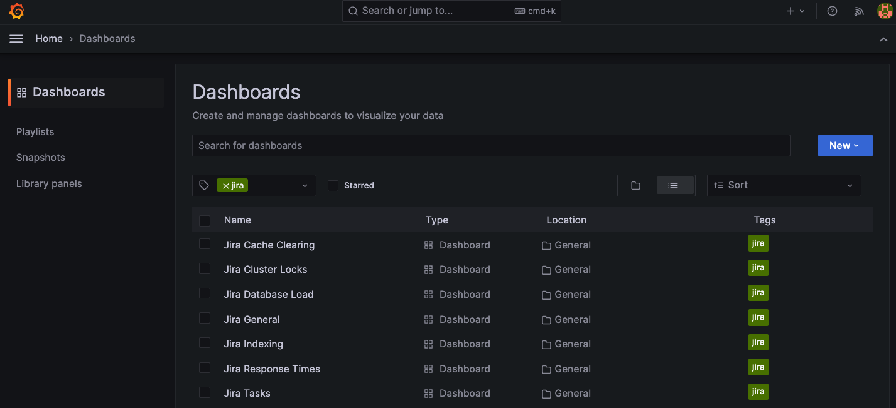

# Pre-canned product charts

The instructions outlined on this page provide details on how you can deploy a set of Grafana dashboards specific to your provisioned DC product(s)

!!!tip "Pre-requisites"
    JMX metrics, Prometheus and Grafana will all need to be provisioned already to make use of this guide. For instructions on how to do this see, [Monitoring with Prometheus](PROMETHEUS.md)

## 1. Enable Pre-canned dashboards

Update the `grafana` stanza within the deployments `values.yaml` to enable dashboard creation with the appropriate labels i.e.

```yaml
monitoring:
  grafana:
    createDashboards: true
    dashboardLabels:
      grafana_dashboard: "1"
```

!!!tip "`grafana_dashboard` value"
    The value to assign to the label `dashboardLabels.grafana_dashboard` can be obtained by examining `Environment` variables for the grafana pod sidecar `grafana-sc-dashboard`. For instance:
    ```bash
    kubectl describe pod prometheus-stack-grafana-57dc5589b-2wh98 -n <prometheus-stack-namespace> | grep -A 20 grafana-sc-dashboard | grep -A 5 Environment
    ```
    **Note:** The name of the Grafana pod (`prometheus-stack-grafana-57dc5589b-2wh98`) may vary slightly between deploys
    

    will return something like
    ```bash
    Environment:
        METHOD:        WATCH
        LABEL:         grafana_dashboard
        LABEL_VALUE:   1
        FOLDER:        /tmp/dashboards
        RESOURCE:      both
    ```
    In this case we're interested in the value for the label `grafana_dashboard`, that is `1`. As such the `grafana` stanza, above` has been updated with this value. 

Now perform an upgrade using the updated `values.yaml`:
```bash
helm upgrade confluence atlassian-data-center/confluence -f values.yaml --wait --namespace <namespace>
```

## 2. Dashboard confirmation

Confirm the dashboards are provisioned and working by running (replace pod name with an actual Grafana pod name):

```
kubectl port-forward prometheus-stack-grafana-57dc5589b-2wh98 3000:3000 -n <prometheus-stack-namespace>
```

Now go to `http://localhost:3000` in your local browser. Once logged into Grafana (The default credentials are `admin:prom-operator`) select **Dashboards > Filter by tag > Product name**. You should be presented with a list of product specific dashboards that can be viewed, for instance



