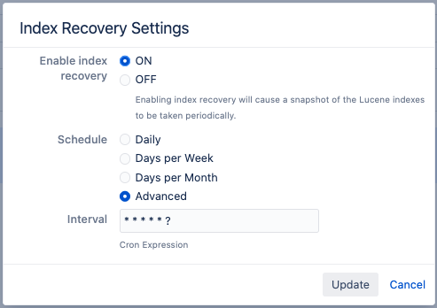

# Creating an initial index snapshot in Jira

These steps should be followed to enable shared index snapshots with Jira:

1. Log into the Jira instance as the Administrator
1. Go to `Settings` -> `System` -> `Indexing`
1. There should be no errors on this page i.e.

1.  If there are errors (as seen below) perform a `Full re-index` before proceeding

1. Once the `Full re-index` is complete, scroll down to `Index Recovery` settings visible on the same page

1. Take note of the current settings
1. Temporarily change these values (`Edit Settings`), as depicted in the screenshot below. The cron expression will create an index snapshot every minute

1. Wait for the snapshot to be created, by checking for an archive in `<shared-home>/export/indexsnapshots`
1. When the snapshot is available, revert the settings noted in `step 6`, or back to the defaults:

1. Consider keeping the `Enable index recovery` setting so that it is set to `ON`
1. Proceed with [scaling the cluster as necessary](RESOURCE_SCALING.md#horizontal-scaling-adding-pods)