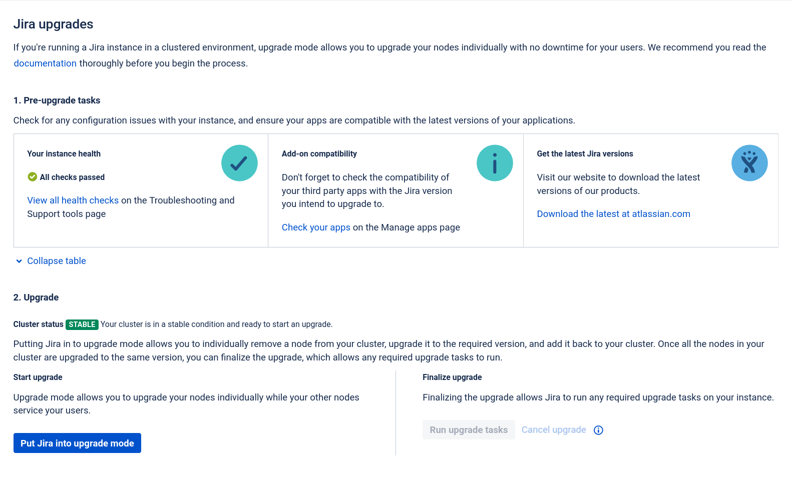
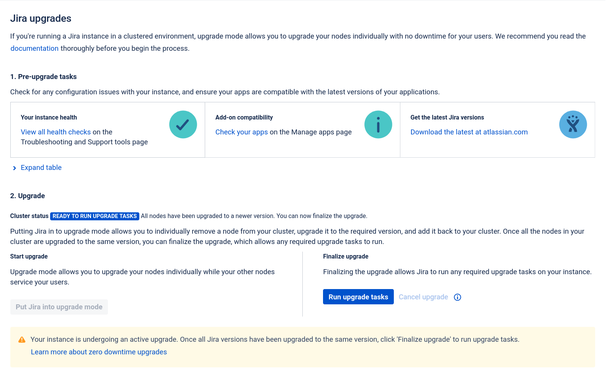
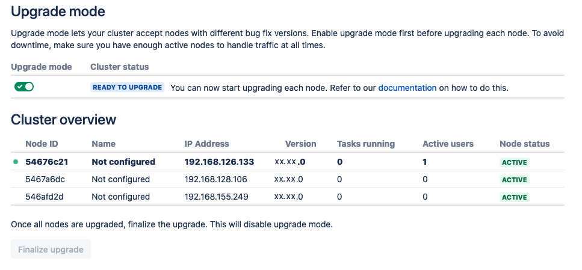
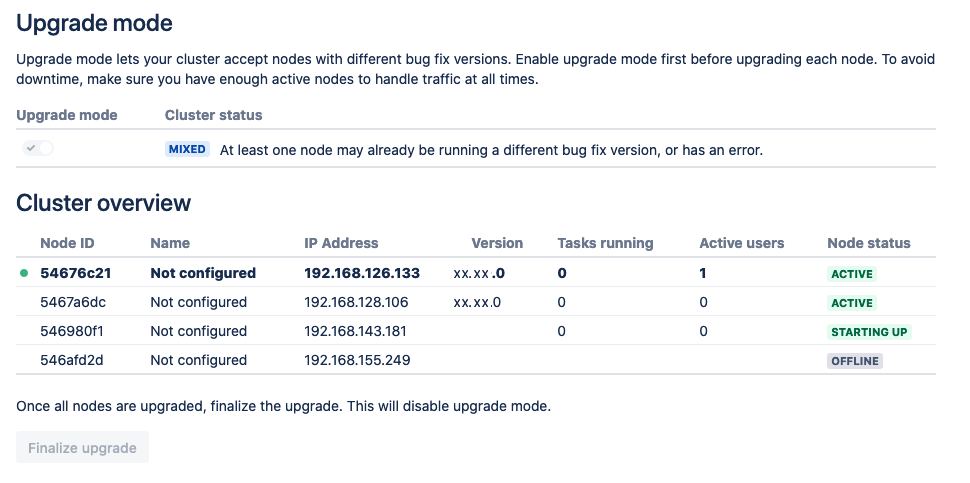
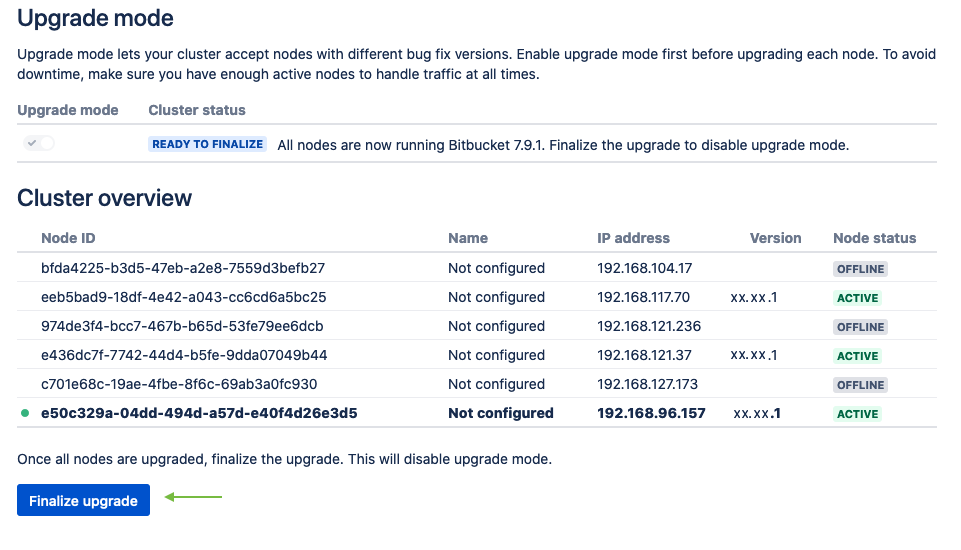

# Products upgrade

We recommend upgrading the Helm chart rather than upgrading the product directly. However, if you want to upgrade the 
product to a specific version that is not listed in the Helm charts, or if you don't want to upgrade Helm chart
to a newer version but you still need to upgrade the product version, then you are in a right place.   

To upgrade the product to a newer version without upgrading the Helm chart follow these steps:

## 1. Find the tag of the target image
Go to the Atlassian Docker Hub page of the relevant product to pick a tag that matches your target version.

!!! note "Atlassian Docker Hub page for supported products:"
    * Jira: [atlassian/jira-software](https://hub.docker.com/r/atlassian/jira-software/tags){.external}
    * Confluence: [atlassian/confluence-server](https://hub.docker.com/r/atlassian/confluence-server/tags){.external}
    * Bitbucket: [atlassian/bitbucket-server](https://hub.docker.com/r/atlassian/bitbucket-server/tags){.external}
    * Bamboo: [atlassian/bamboo](https://hub.docker.com/r/atlassian/bamboo/tags){.external}
    * Bamboo agent: [atlassian/bamboo-agent-base](https://hub.docker.com/r/atlassian/bamboo-agent-base/tags){.external}
    * Crowd: [atlassian/crowd](https://hub.docker.com/r/atlassian/crowd){.external}

In the example you're running Jira using the `8.13.0-jdk11` tag, and you'll be upgrading to `8.13.1-jdk11` - our *target*.
    
## 2. Define the upgrade strategy
There are two strategies to upgrade the application:

* _Normal upgrade_: The service will have interruptions during the upgrade.
* _Rolling upgrade_: The upgrade will proceed with zero downtime.
 
You can use rolling upgrade only if the target version is zero-downtime compatible. 

!!! important "Can you use the rolling upgrade option?"
    To confirm if you can run a rolling upgrade option, check your current and target product versions in the relevant link:  
    
     * Jira: [Upgrading Jira with zero downtime](https://confluence.atlassian.com/adminjiraserver/upgrading-jira-data-center-with-zero-downtime-938846953.html){.external} 
     * Confluence: [Upgrading Confluence with zero downtime](https://confluence.atlassian.com/doc/upgrade-confluence-without-downtime-1027127923.html){.external} 
     * Bitbucket: [Upgrading Bitbucket with zero downtime](https://confluence.atlassian.com/bitbucketserver/upgrade-bitbucket-without-downtime-1038780379.html){.external}
     * Bamboo: Zero downtime upgrades for Bamboo server and Bamboo agents are currently not supported.

## 3. Upgrade the product 
=== "Normal Upgrade"
    
    ### Normal upgrade            
    
    !!! info "The service will have interruptions during the normal upgrade"
        You can use this method to upgrade the Helm chart if:
        
         * The target product version is not zero-downtime compatible
         * If you prefer to avoid running the cluster in mix mode

     The strategy for normal upgrading is to scale down the cluster to zero nodes, and then 
     start one node with the new product version. Then scale up the cluster to the original number of nodes. 
     Here are the step-by-step instructions for the upgrade process:
     
     1. Find out the current number of nodes.
     Run the following command: 
     ```shell
     kubectl describe sts <release-name> --namespace <namespace> | grep 'Replicas'
     ```
     2. Run the upgrade using Helm.
     Based on the product you want to upgrade replace the product name in the following command and run:
     ```shell
     helm upgrade <release-name> atlassian-data-center/<product> \
         --reuse-values \
         --set replicaCount=1 \
         --set image.tag=<target-tag> \
         --wait \
         --namespace <namespace>
     ```
     The cluster will scale down to zero nodes. Then one pod with the target product version will be recreated 
     and join the cluster. 
     
     3. Scale up the cluster.
     After you confirm the new pod is in `Running` status then scale up the cluster to the same number 
     of nodes as before the upgrade: 
     ```shell
     helm upgrade <release-name> atlassian-data-center/confluence \
         --reuse-values \
         --set replicaCount=<n> \
         --wait \
         --namespace <namespace>
     ``` 

=== "Rolling upgrade"
    ### Rolling (zero downtime) upgrade
    
    !!! info "Select the product tab to upgrade"
        Upgrading the product with zero downtime is bit different for each product. Please select the product and follow 
        the steps to complete the rolling upgrade.  
        
    === "Jira"  
        
        ### Jira rolling upgrade
        Let's say we have Jira version `8.19.0` deployed to our Kubernetes cluster, and we want to upgrade it to version
        `8.19.1`, which we'll call the *target version*. You can substitute the target version for the one you need, as long as
        it's newer than the current one.
        
        #### 1. Find tag of the target image.
        
        Go to [atlassian/jira-software](https://hub.docker.com/r/atlassian/jira-software/tags){.external}
        Docker Hub page to pick a tag that matches your target version.
        
        In the example we're running Jira using the `8.19.0-jdk11` tag, and we'll be upgrading to `8.19.1-jdk11` - our *target*.
        
        #### 2. Put Jira into upgrade mode.
        
        Go to **Administration > Applications > Jira upgrades** and click **Put Jira into upgrade mode**.
        
          
        
        #### 3. Run the upgrade using Helm.
        
        Run the Helm *upgrade* command with your release name (`<release-name>`) and the target image from a previous step
        (`<target-tag>`). For more details, refer to the [Helm documentation](https://helm.sh/docs/).
        
         ```shell
         helm upgrade <release-name>  atlassian-data-center/jira \ 
              --wait \
              --reuse-values \
              --set image.tag=<target-tag>
         ```
        
        If you used `kubectl scale` after installing the Helm chart, you'll need to add `--set
        replicaCount=<number-of-jira-nodes>` to the command. Otherwise, the deployment will be scaled back to the original
        number, which most likely is one node.
        
        #### 4. Wait for the upgrade to finish.
        The pods will be recreated with the updated version, one at a time.
        
        
        
        #### 5. Finalize the upgrade.
        After all pods are active with the new version, click **Run upgrade tasks** to finalize the upgrade:
        
        
    
    
    === "Confluence"
        
        ### Confluence rolling upgrade
        Let's say we have Confluence version `7.12.0` deployed to our Kubernetes cluster, and we want to upgrade it to version
        `7.12.1`, which we'll call the *target version*. You can substitute the target version for the one you need, as long as
        it's newer than the current one.
        
        !!!note "Follow the link to confirm the *target version* is zero-downtime compatible"
                [Upgrading Confluence with zero downtime](https://confluence.atlassian.com/doc/upgrade-confluence-without-downtime-1027127923.html){.external} 
    
        #### 1. Find the tag of the target image.
        
        Go to [atlassian/confluence-server](https://hub.docker.com/r/atlassian/confluence-server/tags){.external}
        Docker Hub page to pick a tag that matches your target version.
        
        In the example we're running Confluence using the `7.12.0-jdk11` tag, and we'll be upgrading to `7.12.1-jdk11` - our *target*.
        
        #### 2. Put Confluence into upgrade mode.
        
        From the admin page click on *Rolling Upgrade* and set the Confluence in Upgrade mode:
        
          
        
        #### 3. Run the upgrade using Helm.
        
        Run the Helm *upgrade* command with your release name (`<release-name>`) and the target image from a previous step
        (`<target-tag>`). For more details, refer to the [Helm documentation](https://helm.sh/docs/).
        
         ```shell
         helm upgrade <release-name>  atlassian-data-center/confluence \
             --wait \
             --reuse-values \ 
             --set image.tag=<target-tag>
         ```
        
        If you used `kubectl scale` after installing the Helm chart, you'll need to add `--set
        replicaCount=<number-of-confluence-nodes>` to the command. Otherwise, the deployment will be scaled back to the original
        number, which most likely is one node.
        
        #### 4. Wait for the upgrade to finish.
        The pods will be recreated with the updated version, one at a time.
        
        
        
        #### 5. Finalize the upgrade.
        After all the pods are activated with the new version, finalize the upgrade:
        
        
    
    
    === "Bitbucket"
        
        ### Bitbucket rolling upgrade
        Let's say we have Bitbucket version `7.12.0` deployed to our Kubernetes cluster, and we want to upgrade it to version
        `7.12.1`, which we'll call the *target version*. You can substitute the target version for the one you need, as long as
        it's newer than the current one.
        
        !!!note "Follow the link to find out if the *target version* is zero-downtime compatible"
                [Upgrading Bitbucket with zero downtime](https://confluence.atlassian.com/bitbucketserver/upgrade-bitbucket-without-downtime-1038780379.html){.external}
        #### 1. Find tag of the target image.
        
        Go to [atlassian/bitbucket-server](https://hub.docker.com/r/atlassian/bitbucket-server/tags){.external}
        Docker Hub page to pick a tag that matches your target version.
        
        In the example we're running Bitbucket using the `7.12.0-jdk11` tag, and we'll be upgrading to `7.12.1-jdk11` - our *target*.
        
        #### 2. Put Bitbucket into upgrade mode.
        
        From the admin page click on **Rolling Upgrade** and set the Bitbucket to Upgrade mode:
        
          
        
        #### 3. Run the upgrade using Helm.
        
        Run the Helm *upgrade* command with your release name (`<release-name>`) and the target image from a previous step
        (`<target-tag>`). For more details, consult the [Helm documentation](https://helm.sh/docs/).
        
         ```shell
         helm upgrade <release-name>  atlassian-data-center/bitbucket \
             --wait \
             --reuse-values \
             --set image.tag=<target-tag>
         ```
        
        If you used `kubectl scale` after installing the Helm chart, you'll need to add `--set
        replicaCount=<number-of-bb-nodes>` to the command. Otherwise, the deployment will be scaled back to the original
        number, which most likely is one node.
        
        #### 4. Wait for the upgrade to finish.
        The pods will be recreated with the updated version, one at a time.
        
        
        
        #### 5. Finalize the upgrade.
        After all the pods are active with the new version, finalize the upgrade:
        
        

    === "Bamboo"

        !!!warning "Bamboo and zero downtime upgrades"
            Zero downtime upgrades for Bamboo server and Bamboo agents are currently not supported.

    === "Crowd"
        !!!warning "Crowd and zero downtime upgrades"
            Zero downtime upgrades for Crowd are currently not supported.
        
        
